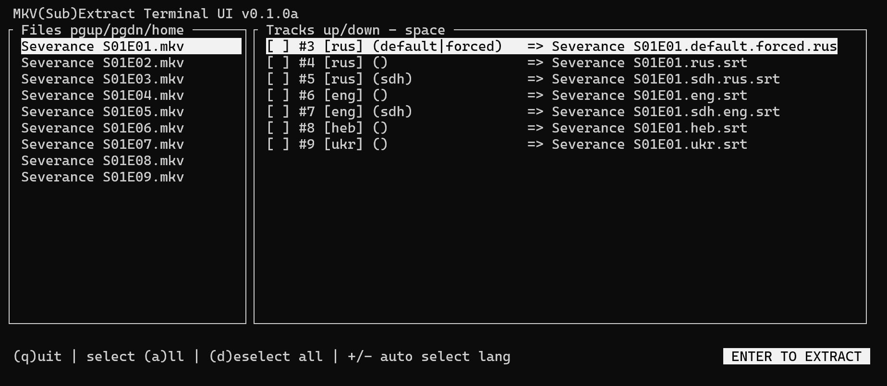

# Mkv(Sub)ExtractTUI
## Currently does not extract since this just a git init.
  

Mkv(Sub)ExtractTUI is a terminal-based user interface for extracting subtitles from MKV containers.

- Currently only supports srt subtitles but I'll add support for others momentarily.



## Features

-  **Terminal UI:** Easy navigation and control for users who prefer working in the terminal.

-  **Track Information:** View detailed information about each track, including track index, language, codec, and more.

-  **Custom Naming:** Customize the output file names based on track properties.

-  **Multi-Track Support:** Extract multiple subtitle tracks simultaneously.

## Usage
Download from releases as binary.(none yet)  
To launch Mkv(Sub)ExtractTUI, simply run the binary.

Custom input directory:
`mkvextracttui -i "path"`
otherwise current working directory is used.

Settings are located in `/home/user/.config/MkvExtractTUI`or`XDG_CONFIG_HOME/MkvExtractTUI`

## Dependencies

-   `ncurses`: Library for creating terminal-based user interfaces.
    
-   `mkvtoolnix`: Set of tools to create, alter, and inspect Matroska files.

You can install the dependencies using your package manager. For example, on Debian-based systems:

```bash
sudo apt-get install ncurses mkvtoolnix
```

## Bulding

Clone the repository and build the project:

```bash
git  clone  https://github.com/Jiiks/MkvExtractTUI.git
cd  mkvextracttui
make  build || make  bar (build and  run)
```

## Contributing

Contributions are welcome! If you find a bug or have a feature request, please open an issue on the GitHub repository. For code contributions, please fork the repository and submit a pull request.

## License

This project is licensed under the MIT License. See the LICENSE file for more details.

## Third party

[ncurses](https://invisible-island.net/ncurses/), [cJSON](https://github.com/DaveGamble/cJSON), mkvtoolnix